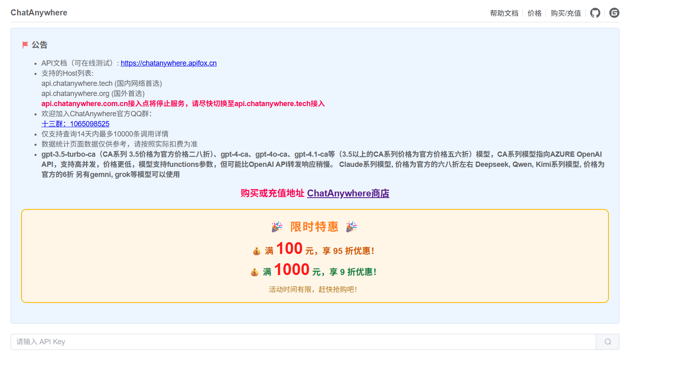
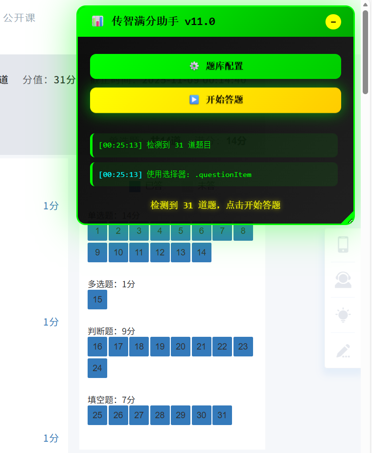
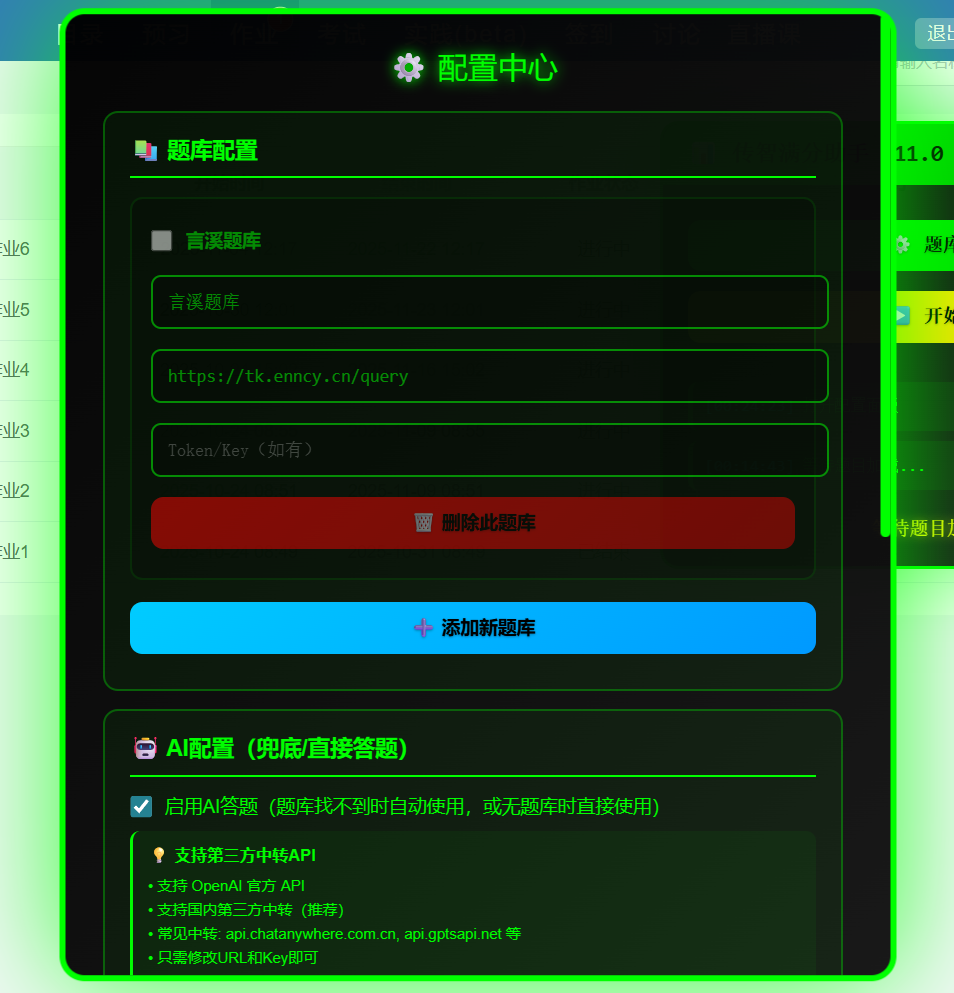
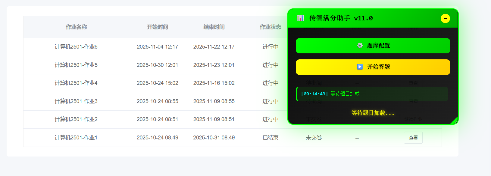

# ityxb
传智教育满分脚本-可配置题库版 2025.11.10

支持言溪题库，把token复制进去即可答题

地址：[https://tk.enncy.cn/](https://tk.enncy.cn/)

AI答题正确配置方法
打开配置面板，填入：
```
API Key: sk-OgpTIaWVlpVB66ib290c867cA4784871B6C6274462C451B0

API地址: https://burn.hair/v1/chat/completions
(注意：必须包含完整路径 /v1/chat/completions)

模型名称: gpt-4o-mini
(或者 gpt-3.5-turbo，看你的中转支持哪个)
```

推荐使用 [https://api.chatanywhere.com.cn]( https://api.chatanywhere.com.cn)的API中转



**脚本预览**










