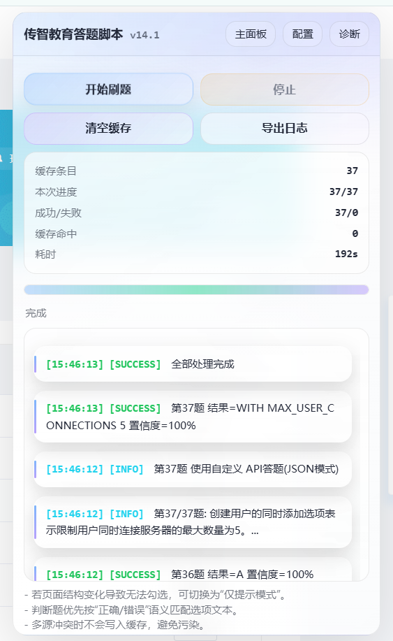
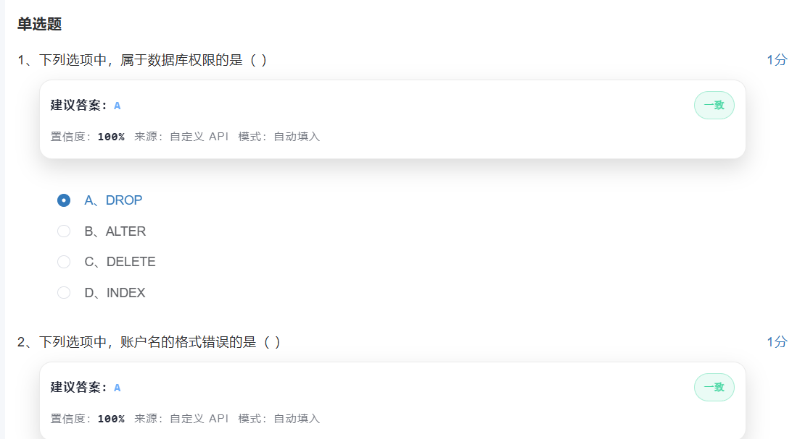
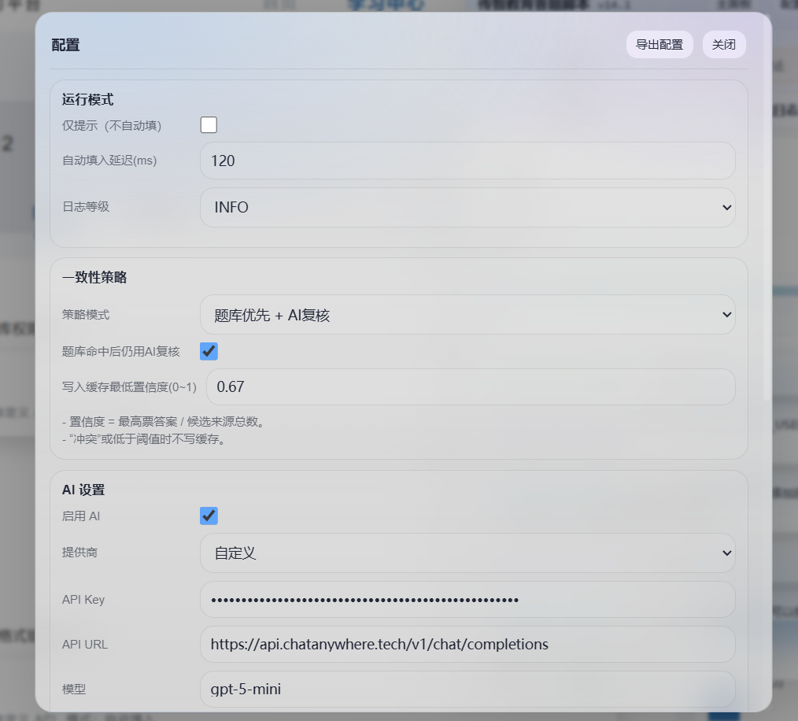
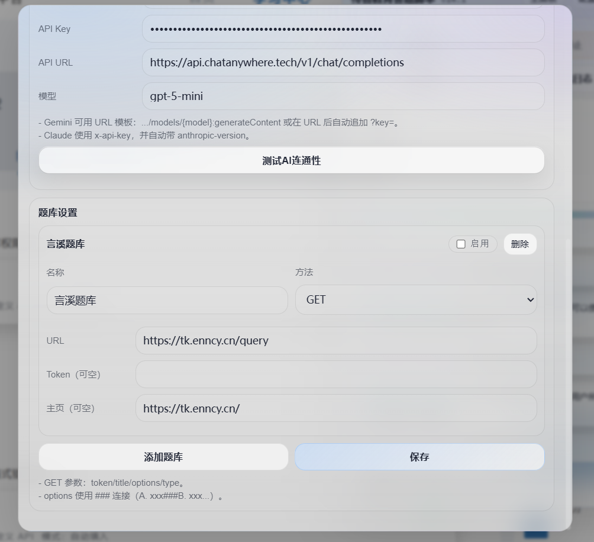

# 传智教育答题脚本（ityxb）

适用于 [**https://stu.ityxb.com/**](https://stu.ityxb.com/) 的油猴（Tampermonkey/Violentmonkey）答题辅助脚本，主打“多源答案 + 一致性置信度 + 可视化诊断”，用于提高做题效率与排查失败原因。

- 当前主版本：**v14.1（20251228）**
- 仓库用途：发布脚本、维护更新、提供安装/更新链接

---

## 功能亮点

- 多来源：题库查询 + AI 模型辅助（可配置启用/禁用）。
- 一致性/置信度：多来源答案聚合；冲突会提示“冲突”，并避免写入缓存，降低误答污染。
- 题目指纹增强：对题干与选项进行归一化并生成指纹，减少“选项顺序变化”导致缓存 miss。
- 自动填入 / 仅提示：可切换自动勾选/填空，或只显示建议答案。
- 日志与诊断：内置失败原因计数与事件记录，支持导出诊断 JSON 便于定位问题。

---

## 安装（推荐 GitHub Raw）

建议用 GitHub Raw 链接安装，便于更新后自动升级（文件名必须以 `.user.js` 结尾）。

- 主脚本（v14.1）：`传智教育答题脚本-14.1-20251228.user.js`

安装方式：
1. 浏览器安装 Tampermonkey / Violentmonkey 扩展。
2. 打开仓库中该脚本文件页面，点击 **Raw**，在弹出的安装页点击安装即可。

---

## 题库配置（言溪题库）

本脚本支持对接「言溪题库」进行答案查询（需要你自行在题库网站获取 Token 并填入配置面板）。
- 题库地址：https://tk.enncy.cn/
- 配置位置：脚本面板 → 配置 → 题库 → 启用并粘贴 Token

---

## AI 配置（可选）

支持多种 AI 提供商（OpenAI / Claude / Gemini / DeepSeek / 自定义 OpenAI 兼容接口），在配置面板中选择提供商并填写：
- API Key：你的 Key（不要写进仓库/README）
- API 地址：你的中转或官方地址（需包含完整路径，例如 `/v1/chat/completions`）
- 模型名称：例如 `gpt-4o-mini`（以你的接口实际支持为准）

安全提示：**不要**在 README、Issues、Commit 中提交任何 API Key（泄露后可能被滥用并产生费用）。

---

## 截图预览

> 请将图片放到仓库目录 `_resources/` 下，然后在 README 使用相对路径引用。

**脚本预览**

---

## 免责声明

本项目仅用于学习研究与个人效率辅助，请遵守平台规则与法律法规。因使用本脚本造成的任何后果由使用者自行承担。

---

## 反馈与贡献

欢迎提交 Issue/PR：
- 提供：题目页截图、导出的日志、导出的诊断 JSON（更容易定位 DOM 变化/接口变化）。
